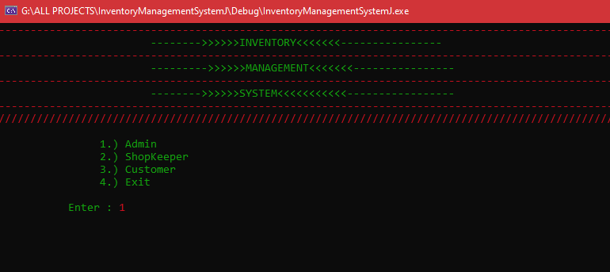
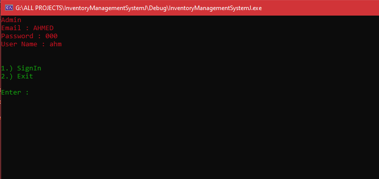
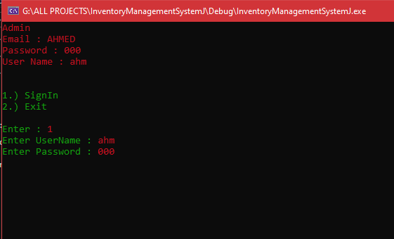

# Inventory Management System (IMS) - C++ Version

## Overview

[Insert a brief description of your inventory management system.]

## Screenshots

*Caption for Screenshot 1.*

*Caption for Screenshot 2.*

*Caption for Screenshot 3.*

*Caption for Screenshot 4.*

## Getting Started

[Insert details about how to download, build, and run your C++ IMS on Visual Studio.]

## Usage

[Provide instructions on how to use your Inventory Management System.]

## Contributing

[Explain how others can contribute to your project.]

## License

This project is licensed under the MIT License - see the [LICENSE.md](LICENSE.md) file for details.
